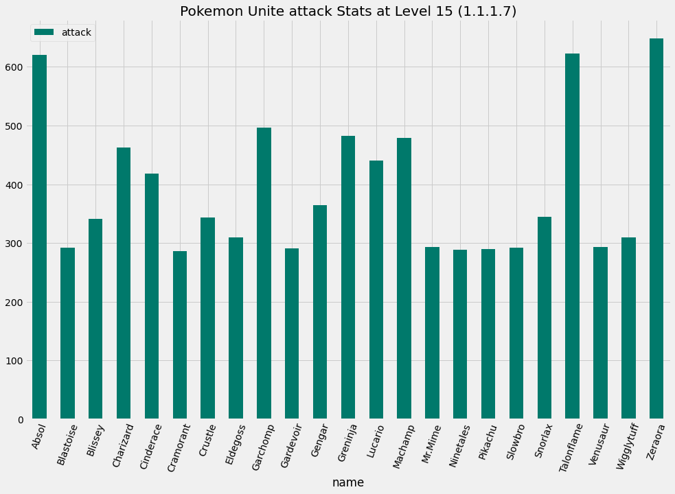
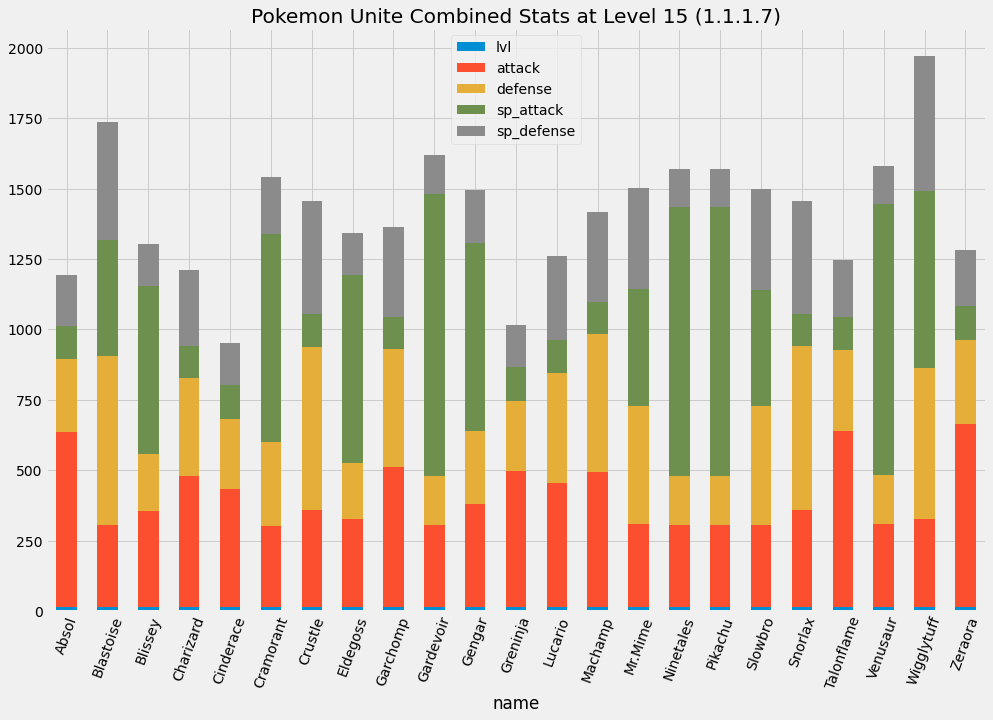

# pokemon-unite
Pokémon Unite - data science on pokemon stats

## How do I run this locally?
- 
- Download the stats json file from the [uniteJSONs folder](./uniteJSONs) in this repo
- Upload the stats json file into the Google Colab files section on the left.
- Make sure the file name of the stats json file matches the file reading statement in the first block
- Runtime>Run all

Voilà! You've now ran the code. If you want different levels/stats just change out the block where I set the `level` and `stat` variables and re-run.

## Example graphs

