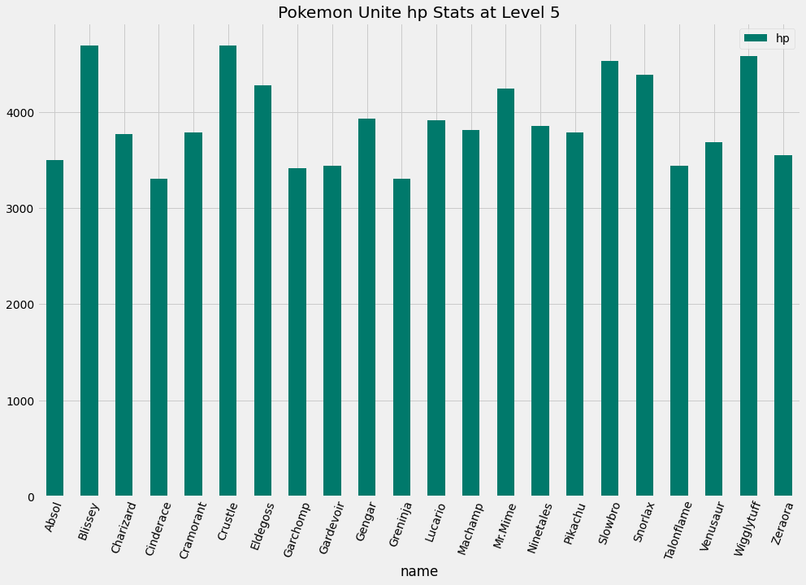
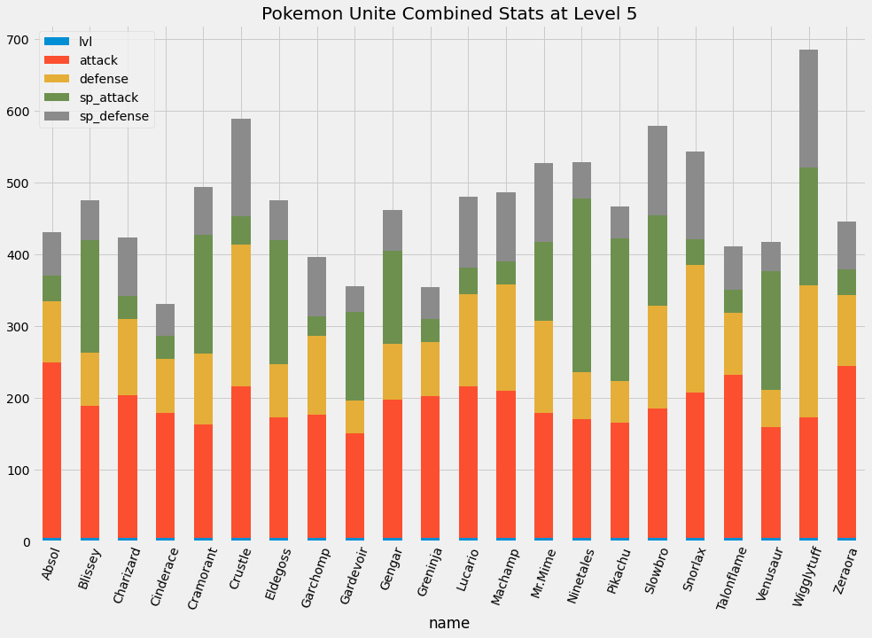

# pokemon-unite
Pokémon Unite - data science on pokemon stats

## How do I run this locally?
- 
- Runtime>Run all

Voilà! You've now ran the code. If you want different levels/stats just change out the block where I set the `level` and `stat` variables and re-run.

## Example graphs

